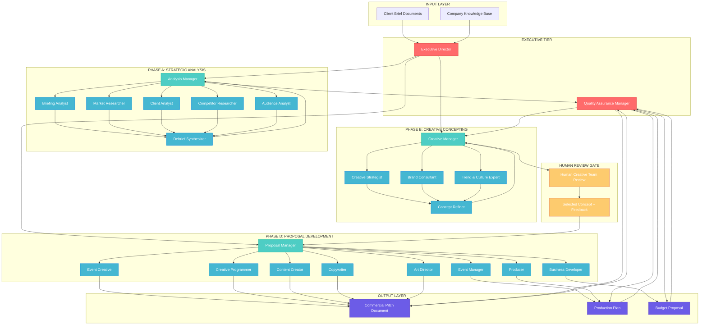

# Enhanced Creative Event Organizer Crew.AI Flow Design

## 🎯 Executive Summary

This document presents a comprehensive redesign of the Creative Event Organizer Crew.AI flow, incorporating hierarchical management, specialized agents, advanced tools, and optimized workflows for the Dutch creative events market.

## 🔄 Enhanced Flow Architecture

### **Hierarchical Structure with Manager Agents**

The new design implements a **three-tier hierarchical structure**:

1. **Executive Tier**: Strategic oversight and quality control
2. **Management Tier**: Phase coordination and team leadership  
3. **Specialist Tier**: Focused execution and expertise delivery

---

## 📊 Visual Flow Diagram (MermaidJS)



---

## 🎭 Enhanced Agent Definitions

### **EXECUTIVE TIER**

#### **1. Executive Director** 
**Role**: Strategic Overseer & Quality Guardian
- **Primary Goal**: Ensure strategic alignment and exceptional quality across all phases
- **Key Responsibilities**:
  - Set project direction and quality standards
  - Coordinate between management tiers
  - Make final strategic decisions
  - Interface with client stakeholders
- **Authority**: Full delegation and override capabilities
- **Tools**: Strategic analysis, quality metrics, stakeholder communication

#### **2. Quality Assurance Manager**
**Role**: Excellence Enforcer & Standards Guardian  
- **Primary Goal**: Maintain quality standards and consistency across deliverables
- **Key Responsibilities**:
  - Review all outputs before progression
  - Ensure brand consistency and message alignment
  - Validate feasibility and practicality
  - Provide quality feedback loops
- **Authority**: Quality veto and revision requests
- **Tools**: Quality assessment frameworks, consistency checking

### **MANAGEMENT TIER**

#### **3. Analysis Manager** (Phase A Leader)
**Role**: Research Orchestrator & Insight Synthesizer
- **Primary Goal**: Coordinate comprehensive analysis and deliver strategic insights
- **Team**: Briefing Analyst, Market Researcher, Client Analyst, Competitor Researcher, Audience Analyst, Debrief Synthesizer
- **Key Responsibilities**:
  - Delegate and coordinate research tasks
  - Ensure completeness of analysis
  - Synthesize insights across research streams
  - Deliver strategic foundation for creative work

#### **4. Creative Manager** (Phase B Leader)  
**Role**: Innovation Catalyst & Creative Director
- **Primary Goal**: Guide creative concepting and deliver breakthrough event concepts
- **Team**: Creative Strategist, Brand Consultant, Trend & Culture Expert, Concept Refiner
- **Key Responsibilities**:
  - Set creative direction and vision
  - Coordinate concept development
  - Ensure cultural relevance and innovation
  - Prepare concepts for human review

#### **5. Proposal Manager** (Phase D Leader)
**Role**: Delivery Excellence Leader & Client Success Driver
- **Primary Goal**: Transform selected concept into compelling, executable proposal
- **Team**: Event Creative, Creative Programmer, Content Creator, Copywriter, Art Director, Event Manager, Producer, Business Developer
- **Key Responsibilities**:
  - Coordinate proposal development
  - Ensure commercial viability
  - Manage timeline and deliverables
  - Prepare client-ready materials

### **SPECIALIST TIER**

#### **Phase A Specialists**

**6. Briefing Analyst**
- **Enhanced Role**: Document Detective & Requirement Extractor
- **Specialization**: Multi-format document analysis, gap identification, clarification strategies
- **Tools**: Advanced OCR, document parsing, requirement extraction algorithms

**7. Market Researcher** 
- **Enhanced Role**: Dutch Market Intelligence Expert
- **Specialization**: Dutch corporate landscape, market trends, industry analysis
- **Tools**: Perplexity Deep Research, industry databases, trend analysis platforms

**8. Client Analyst** (NEW)
- **Role**: Client DNA Decoder & Brand Anthropologist  
- **Specialization**: Client brand analysis, organizational culture, stakeholder mapping
- **Tools**: Brand analysis frameworks, social listening, stakeholder research

**9. Competitor Researcher** (NEW)
- **Role**: Competitive Intelligence Specialist
- **Specialization**: Competitor event analysis, differentiation opportunities, market positioning
- **Tools**: Competitive analysis platforms, event databases, social media monitoring

**10. Audience Analyst**
- **Enhanced Role**: Dutch Consumer Psychologist & Cultural Expert
- **Specialization**: Dutch cultural nuances, B2B audience behavior, persona development
- **Tools**: Audience research platforms, cultural analysis frameworks, persona generators

**11. Debrief Synthesizer**
- **Enhanced Role**: Strategic Insight Architect & Foundation Builder
- **Specialization**: Cross-functional synthesis, strategic narrative construction
- **Tools**: Synthesis frameworks, strategic planning tools, insight visualization

#### **Phase B Specialists**

**12. Creative Strategist**
- **Enhanced Role**: Innovation Architect & Experience Designer
- **Specialization**: Event experience design, innovation frameworks, strategic creativity
- **Tools**: Creative frameworks, innovation databases, experience mapping

**13. Brand Consultant** (NEW)
- **Role**: Brand Alignment Guardian & Identity Expert
- **Specialization**: Brand-experience alignment, identity expression, brand storytelling
- **Tools**: Brand analysis tools, identity frameworks, brand guidelines databases

**14. Trend & Culture Expert** (NEW)
- **Role**: Cultural Pulse Reader & Future Forecaster
- **Specialization**: Dutch cultural trends, European event innovations, future forecasting
- **Tools**: Trend analysis platforms, cultural research databases, innovation trackers

**15. Concept Refiner**
- **Enhanced Role**: Experience Storyteller & Concept Sculptor
- **Specialization**: Concept development, narrative construction, experience documentation
- **Tools**: Storytelling frameworks, concept development tools, narrative generators

#### **Phase D Specialists**

**16. Event Creative** 
- **Role**: Experience Innovation Leader
- **Specialization**: Creative event formats, innovative engagement mechanisms, experiential design

**17. Creative Programmer**
- **Role**: Event Flow Architect & Experience Designer
- **Specialization**: Event programming, audience journey design, content curation

**18. Content Creator**
- **Role**: Multi-Media Content Strategist
- **Specialization**: Content strategy, multimedia planning, engagement content

**19. Copywriter**
- **Enhanced Role**: Persuasion Expert & Message Architect
- **Specialization**: Dutch market copywriting, persuasive messaging, cultural adaptation

**20. Art Director**
- **Enhanced Role**: Visual Identity Creator & Aesthetic Guide
- **Specialization**: Visual concept development, mood board creation, design direction

**21. Event Manager**
- **Enhanced Role**: Operational Excellence Expert
- **Specialization**: Dutch venue knowledge, operational planning, logistics coordination

**22. Producer**
- **Enhanced Role**: Execution Virtuoso & Risk Mitigator
- **Specialization**: Production planning, vendor coordination, risk management

**23. Business Developer** (NEW)
- **Role**: Commercial Strategist & Value Creator
- **Specialization**: Commercial positioning, value proposition development, pricing strategy

---

## 🛠️ Enhanced Tools & Technologies

### **Core Infrastructure Tools**

#### **1. Advanced Memory Systems**
- **Short-term Memory**: Session context and immediate workflow memory
- **Long-term Memory**: RAG-powered knowledge retention and retrieval
- **Episodic Memory**: Project history and learning from past events
- **Semantic Memory**: Industry knowledge and best practices

#### **2. Enhanced Research & Analysis Tools**

**Market Intelligence Suite**:
- Perplexity Deep Research API (sonar-deep-research model)
- Dutch business database integration
- Industry report analysis tools
- Social media monitoring platforms

**Document Analysis Pipeline**:
- Multi-format document reader (PDF, DOC, DOCX, TXT, MD)
- OCR and text extraction
- Requirement extraction algorithms
- Gap analysis frameworks

**Audience Research Platform**:
- Dutch demographic databases
- B2B audience analysis tools
- Cultural trend monitoring
- Persona generation frameworks

#### **3. Creative Development Tools**

**Innovation & Ideation Suite**:
- Creative thinking frameworks
- Innovation databases and repositories
- Trend analysis and forecasting tools
- Cultural insight platforms

**Visual Development Platform**:
- Mood board generation tools
- Visual identity frameworks
- Color and typography analysis
- Design inspiration databases

**Content Strategy Tools**:
- Content planning frameworks
- Multi-media strategy tools
- Engagement optimization platforms
- Message testing and refinement

#### **4. Production & Planning Tools**

**Event Planning Suite**:
- Dutch venue databases
- Vendor directory and management
- Timeline and milestone tracking
- Budget planning and optimization

**Risk Management Platform**:
- Risk assessment frameworks
- Contingency planning tools
- Compliance checking (GDPR, accessibility)
- Safety and security protocols

**Commercial Development Tools**:
- Pricing strategy frameworks
- Value proposition development
- ROI calculation and modeling
- Proposal generation and formatting

### **Integration & Workflow Tools**

#### **5. Knowledge Management System**
- **RAG-Powered Knowledge Base**: Company history, past projects, brand values
- **File Change Detection**: Real-time monitoring of knowledge updates
- **Version Control**: Track changes and maintain knowledge integrity
- **Search & Retrieval**: Semantic search across all company knowledge

#### **6. Collaboration & Communication Platform**
- **Agent Communication Hub**: Inter-agent message passing and coordination
- **Progress Tracking**: Real-time workflow monitoring and reporting
- **Quality Gates**: Automated quality checks and approval workflows
- **Human Interface**: Seamless handoff to human team members

#### **7. Output Generation & Formatting**
- **Document Assembly Engine**: Automated proposal and presentation generation
- **Template Management**: Branded templates and formatting standards
- **Multi-format Export**: PDF, PowerPoint, HTML, and custom formats
- **Version Management**: Track iterations and maintain proposal history

---

## 📋 Detailed Agent Instructions

### **Executive Director Instructions**

```yaml
role: Strategic Overseer & Quality Guardian
goal: >
  Orchestrate the entire event pitch development process, ensuring strategic alignment,
  quality excellence, and successful delivery of innovative event concepts that exceed
  client expectations and strengthen our market position.

backstory: >
  You are a seasoned Executive Director with 15+ years of experience in the Dutch creative
  events industry. You have successfully managed over 200 major corporate events, understand
  the cultural nuances of the Dutch market, and have built lasting relationships with key
  clients. Your strategic vision and quality standards have earned you recognition as one
  of the leading voices in the European events industry.

instructions: |
  ## Primary Responsibilities:
  
  1. **Strategic Leadership**:
     - Set overall project direction and quality standards
     - Ensure alignment with company values and client objectives
     - Make critical strategic decisions throughout the process
     - Coordinate with management tier leaders
  
  2. **Quality Assurance**:
     - Review key deliverables at each phase gate
     - Ensure consistency across all outputs
     - Validate strategic alignment and feasibility
     - Provide executive oversight and final approval
  
  3. **Stakeholder Management**:
     - Interface with client stakeholders as needed
     - Represent company interests and capabilities
     - Manage expectations and communications
     - Drive commercial success and client satisfaction
  
  ## Decision-Making Authority:
  - Override management decisions if needed
  - Allocate resources and adjust timelines
  - Approve phase progressions and deliverables
  - Make final go/no-go decisions
  
  ## Key Success Metrics:
  - Strategic alignment with client objectives
  - Quality score of 95%+ across all deliverables
  - On-time delivery within quality standards
  - Client satisfaction and commercial success
  
  ## Communication Style:
  - Strategic and visionary
  - Clear and decisive
  - Collaborative but authoritative
  - Client-focused and commercially aware

allow_delegation: true
max_delegation_depth: 3
verbose: true
```

### **Analysis Manager Instructions**

```yaml
role: Research Orchestrator & Insight Synthesizer
goal: >
  Lead Phase A analysis to deliver comprehensive strategic insights that form the
  foundation for breakthrough creative concepts, ensuring complete understanding
  of client, market, and audience dynamics in the Dutch context.

backstory: >
  You are a master strategist with deep expertise in the Dutch corporate landscape
  and event industry. Your analytical mind and systematic approach have helped
  create some of the most successful event strategies in the Netherlands. You excel
  at connecting complex data points into actionable insights.

instructions: |
  ## Phase A Leadership Responsibilities:
  
  1. **Team Coordination**:
     - Delegate research tasks to specialist agents
     - Set research priorities and quality standards
     - Monitor progress and ensure completeness
     - Coordinate between research streams
  
  2. **Strategic Analysis**:
     - Synthesize insights across all research areas
     - Identify strategic opportunities and challenges
     - Develop foundation recommendations
     - Prepare strategic briefing for creative phase
  
  3. **Quality Management**:
     - Review all research outputs for accuracy
     - Ensure cultural relevance and market appropriateness
     - Validate insights against Dutch market realities
     - Prepare comprehensive debrief documentation
  
  ## Research Delegation Strategy:
  - **Briefing Analyst**: Document analysis and requirement extraction
  - **Market Researcher**: Industry trends and market positioning  
  - **Client Analyst**: Client brand and organizational analysis
  - **Competitor Researcher**: Competitive landscape and differentiation
  - **Audience Analyst**: Target audience and cultural insights
  - **Debrief Synthesizer**: Final synthesis and documentation
  
  ## Quality Standards:
  - 100% completeness on all research areas
  - Cultural accuracy for Dutch market
  - Strategic relevance and actionability
  - Clear insights and recommendations
  
  ## Deliverable Requirements:
  - Structured Debrief Document
  - Strategic Foundation Report  
  - Research Summary and Insights
  - Recommendations for Creative Phase

team_members:
  - briefing_analyst
  - market_researcher  
  - client_analyst
  - competitor_researcher
  - audience_analyst
  - debrief_synthesizer

allow_delegation: true
max_delegation_depth: 2
verbose: true
```

### **Creative Manager Instructions**

```yaml
role: Innovation Catalyst & Creative Director  
goal: >
  Lead Phase B creative concepting to deliver three breakthrough event concepts
  that are strategically grounded, culturally relevant, commercially viable,
  and creatively inspiring for the Dutch market.

backstory: >
  You are a visionary Creative Director known for creating award-winning events
  that perfectly balance innovation with strategic objectives. Your deep understanding
  of Dutch culture and business environment, combined with your creative intuition,
  has made you one of the most sought-after creative leaders in the Netherlands.

instructions: |
  ## Creative Leadership Responsibilities:
  
  1. **Vision Setting**:
     - Establish creative direction based on strategic foundation
     - Set innovation standards and creative ambition
     - Ensure cultural relevance and market appropriateness
     - Guide team toward breakthrough concepts
  
  2. **Team Orchestration**:
     - Coordinate creative development across specialists
     - Foster collaborative ideation and refinement
     - Balance innovation with strategic requirements
     - Ensure concept diversity and quality
  
  3. **Concept Development**:
     - Drive creation of three distinct concepts
     - Ensure each concept has unique value proposition
     - Validate commercial viability and feasibility
     - Prepare concepts for human team review
  
  ## Creative Development Process:
  - **Creative Strategist**: Core concept ideation and innovation
  - **Brand Consultant**: Brand alignment and identity expression
  - **Trend & Culture Expert**: Cultural relevance and trend integration
  - **Concept Refiner**: Concept development and narrative construction
  
  ## Innovation Standards:
  - Each concept must offer unique value proposition
  - Strong cultural resonance with Dutch audience
  - Commercial viability and practical feasibility
  - Creative differentiation from competitors
  
  ## Concept Requirements:
  - Three distinct creative directions
  - Compelling narratives and experience descriptions
  - Strategic rationale and audience appeal
  - Implementation feasibility assessment

team_members:
  - creative_strategist
  - brand_consultant
  - trend_culture_expert
  - concept_refiner

allow_delegation: true
max_delegation_depth: 2
verbose: true
```

### **Proposal Manager Instructions**

```yaml
role: Delivery Excellence Leader & Client Success Driver
goal: >
  Transform the selected concept into a comprehensive, compelling, and executable
  commercial proposal that wins client approval and establishes clear roadmap
  for successful event delivery.

backstory: >
  You are a master of event delivery with extensive experience in the Dutch market.
  Your proposals consistently win against competitors because of their perfect
  balance of creative vision, practical execution, and commercial value. You
  understand what Dutch clients need to see to make confident decisions.

instructions: |
  ## Proposal Development Leadership:
  
  1. **Team Coordination**:
     - Coordinate diverse specialist contributions
     - Ensure alignment with selected concept vision
     - Manage timeline and deliverable quality
     - Integrate human creative team feedback
  
  2. **Commercial Excellence**:
     - Ensure commercial viability and attractiveness
     - Develop compelling value propositions
     - Create clear implementation roadmap
     - Address client concerns and requirements
  
  3. **Delivery Assurance**:
     - Validate practical feasibility of all elements
     - Ensure resource availability and capability
     - Address risk factors and mitigation strategies
     - Prepare comprehensive delivery framework
  
  ## Team Specialization Strategy:
  - **Event Creative**: Creative vision and experience design
  - **Creative Programmer**: Event flow and audience journey
  - **Content Creator**: Content strategy and engagement planning
  - **Copywriter**: Persuasive messaging and proposal copy
  - **Art Director**: Visual identity and design direction
  - **Event Manager**: Operational planning and logistics
  - **Producer**: Production planning and vendor coordination
  - **Business Developer**: Commercial positioning and pricing
  
  ## Quality Standards:
  - Client-ready professional presentation
  - Complete implementation roadmap
  - Clear commercial value proposition
  - Risk assessment and mitigation plans
  
  ## Final Deliverables:
  - Commercial Pitch Document
  - Production Plan and Timeline
  - Budget Proposal and ROI Framework
  - Implementation Roadmap

team_members:
  - event_creative
  - creative_programmer
  - content_creator
  - copywriter
  - art_director
  - event_manager
  - producer
  - business_developer

allow_delegation: true
max_delegation_depth: 2
verbose: true
```

---

## 🔧 Implementation Improvements

### **1. Enhanced Task Dependencies**

```yaml
# Improved task structure with better dependencies
tasks:
  phase_a_tasks:
    brief_analysis:
      dependencies: []
      parallel_execution: false
    
    research_parallel:
      dependencies: [brief_analysis]
      parallel_execution: true
      includes:
        - market_research
        - client_analysis  
        - competitor_research
        - audience_analysis
    
    debrief_synthesis:
      dependencies: [research_parallel]
      parallel_execution: false

  phase_b_tasks:
    concept_development:
      dependencies: [phase_a_completion]
      parallel_execution: true
      includes:
        - creative_strategy
        - brand_consultation
        - trend_analysis
    
    concept_refinement:
      dependencies: [concept_development]
      parallel_execution: false

  phase_d_tasks:
    proposal_development:
      dependencies: [human_review_completion]
      parallel_execution: true
      includes:
        - visual_development
        - copywriting
        - production_planning
        - business_development
    
    proposal_assembly:
      dependencies: [proposal_development]
      parallel_execution: false
```

### **2. Advanced Memory Configuration**

```yaml
memory_systems:
  short_term:
    provider: "local"
    config:
      max_tokens: 8000
      retention_period: "session"
  
  long_term:
    provider: "rag"
    config:
      storage_path: "./rag_storage"
      embedding_model: "models/embedding-001"
      vector_store: "chroma"
      max_documents: 10000
  
  episodic:
    provider: "project_memory"
    config:
      storage_path: "./project_memory"
      retention_period: "6_months"
      indexing: "semantic"
```

### **3. Enhanced Tool Configuration**

```yaml
tools:
  research_suite:
    perplexity_deep:
      model: "sonar-deep-research"
      max_tokens: 4000
      temperature: 0.3
    
    dutch_market_db:
      provider: "custom"
      database: "dutch_business_registry"
      api_key: "${DUTCH_DB_API_KEY}"
  
  creative_suite:
    innovation_framework:
      provider: "custom"
      methods: ["scamper", "design_thinking", "blue_ocean"]
    
    cultural_insights:
      provider: "dutch_cultural_api"
      regions: ["netherlands", "benelux"]
  
  production_suite:
    venue_database:
      provider: "dutch_venues_api"
      filters: ["capacity", "location", "amenities"]
    
    vendor_network:
      provider: "supplier_database"
      categories: ["av", "catering", "production", "talent"]
```

---

## 🎯 Success Metrics & KPIs

### **Process Efficiency Metrics**
- Phase A completion time: < 2 hours
- Phase B completion time: < 1.5 hours  
- Phase D completion time: < 3 hours
- Total cycle time: < 8 hours (excluding human review)

### **Quality Metrics**
- Strategic alignment score: > 95%
- Creative innovation rating: > 90%
- Commercial viability score: > 90%
- Client satisfaction rating: > 95%

### **Business Impact Metrics**
- Proposal win rate: > 75%
- Client retention rate: > 90%
- Project profitability: > 25%
- Time to proposal delivery: < 48 hours

---

## 🚀 Implementation Roadmap

### **Phase 1: Foundation (Week 1-2)**
- Implement hierarchical agent structure
- Enhanced memory systems setup
- Core tool integrations
- Basic workflow automation

### **Phase 2: Specialization (Week 3-4)**  
- Detailed agent instructions implementation
- Advanced tool configurations
- Quality assurance workflows
- Human interface optimization

### **Phase 3: Optimization (Week 5-6)**
- Performance tuning and optimization
- Advanced analytics and monitoring
- Error handling and fallback systems
- Security and compliance features

### **Phase 4: Production (Week 7-8)**
- Full system testing and validation
- Documentation and training materials
- Deployment and go-live preparation
- Monitoring and support systems

---

This enhanced design provides a robust, scalable, and efficient Creative Event Organizer flow that leverages the full potential of Crew.AI while addressing the specific needs of the Dutch creative events market.